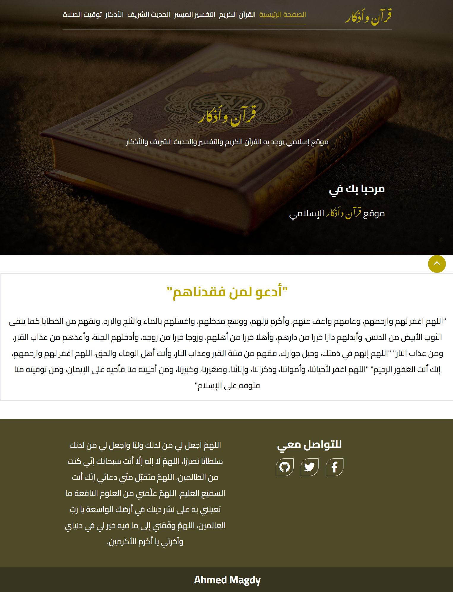
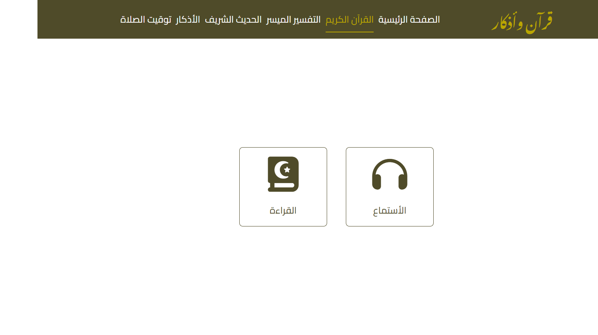
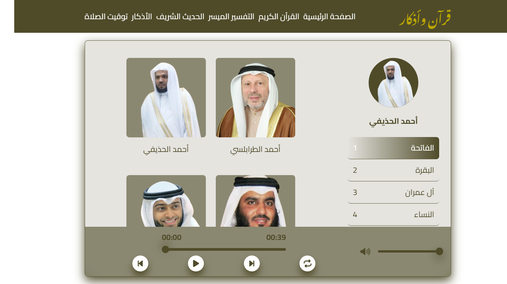
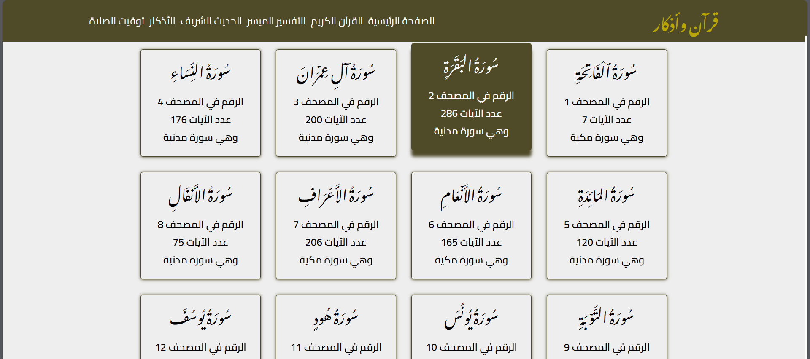
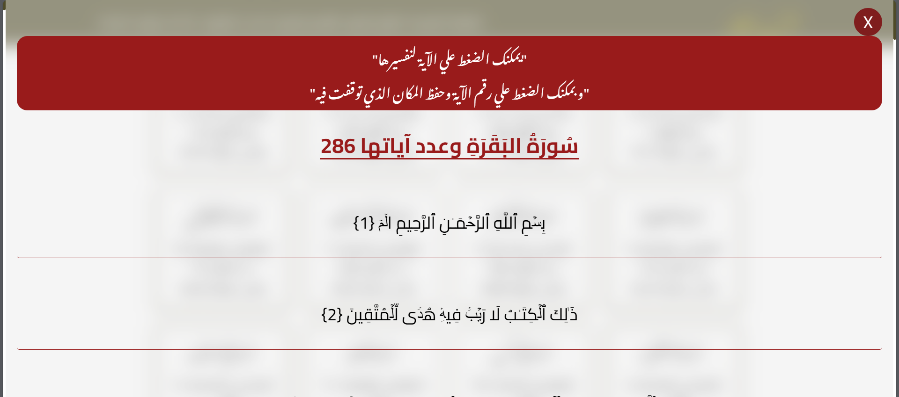
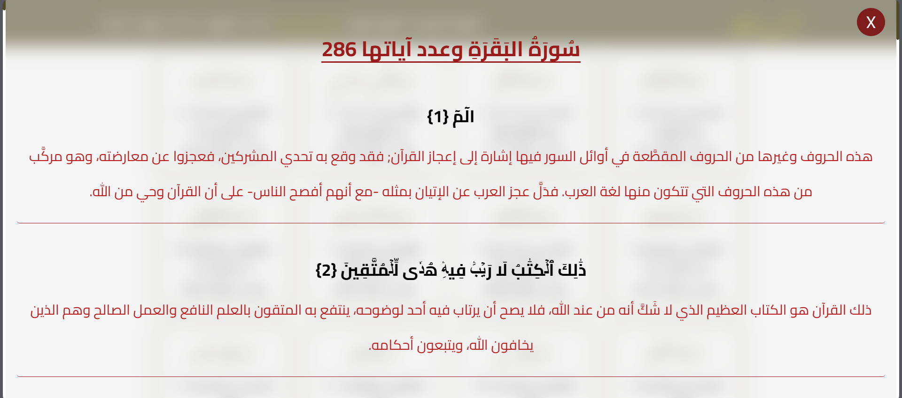
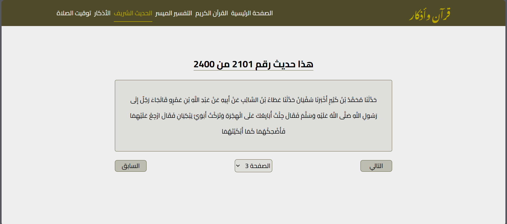
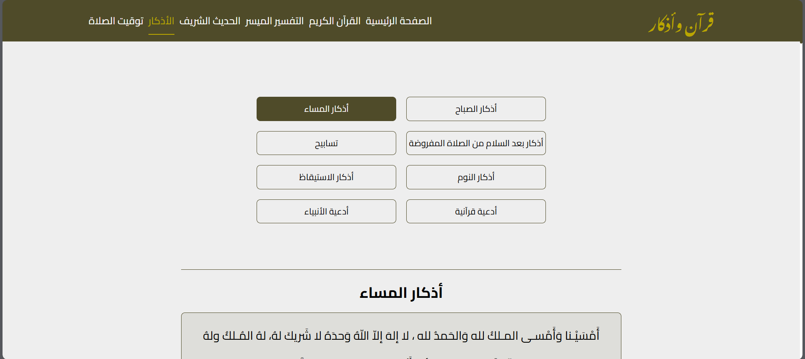
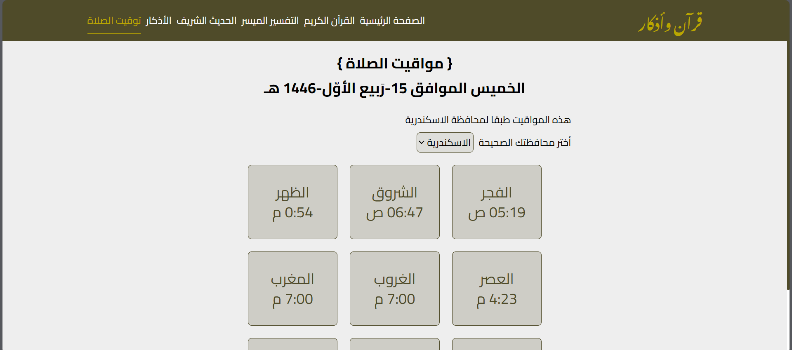

# Quran And Azkar

## What is Quran And Azkar?

This website contains the Noble Qur’an, interpretation of the Qur’an, Hadith, morning and evening remembrances, supplications of the Prophets from the Qur’an, praises, and much more.

## Who Am I ?

I'm Ahmed Magdy, I'm Front-End Developer.

## What technology is used here?

I used Html, Css "Tailwind", Javascript, Apis For Get The Data To All Sections And Pages.

## Review The Site

### Main Page And Landing

## We Add New Thing To This Site

Quran player through which we can listen to the Quran in more than 110 different voices.

### Choose To Read Or Listen Quran Page

### Listen Quran Page (Quran Player)

### Read Quran Page

### Tafsir Quran Page

Here We Have The same List Of Surahs In Read Quran Page Then You Can Choise The Surah You Want Then Read The Tafsir Of It.

### Hadeeth Sharif

### Azkar Page

Here You Can Choise The Azkar You Want.

### The Pray Timing

## Links

- Facebook
  https://www.facebook.com/profile.php?id=100085749470017

- X
  https://twitter.com/ahmed_magdy135
